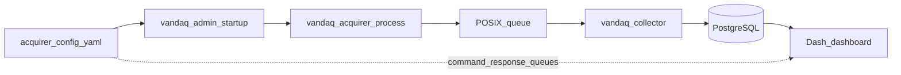

# Adding a new instrument

This guide walks through integrating a new instrument into VanDAQ using an **existing acquirer type**: author the YAML config, start the acquirer process, confirm data reaches PostgreSQL, and optionally wire the Dash dashboard for live plots and controls.

For the full list of YAML keys and per-type options, see [Data chain configuration](data_chain_configuration.md). For architecture and measurement-dict fields, see [Overview](overview.md).

## How it fits in the data chain




Each instrument is one **acquirer process** reading hardware or a network stream, parsing lines or messages into measurement dicts, and writing them to a POSIX message queue (typically `/dev-measurements`). The collector batches those messages into the database. The dashboard reads the database and, for some instruments, sends commands back through separate POSIX queues.

You do **not** need to pre-register the instrument in the database. The collector creates `instrument` and `parameter` dimension rows the first time it sees them.

## Prerequisites

- VanDAQ installed on the DAQ host with PostgreSQL and the collector running.
- `vandaq_admin` configured to launch acquirers and the collector (see `vandaq_admin.yaml`).
- For hardware instruments: serial device path (often `/dev/usb_serial_<Name>`), baud rate, and a sample of the instrument’s output lines (or NMEA sentences) to design `stream` / `data` parsing.
- Queue settings in your new acquirer config must match the collector’s queue block (see `collector/vandaq_collector.yaml`: `name`, `max_msg_size`, `max_msgs`).

## 1. Choose an acquirer `type`

The `type` field selects which Python acquirer class runs. Pick the closest match to your protocol:


| Instrument protocol                           | `type`             | Example config                                                                          |
| --------------------------------------------- | ------------------ | --------------------------------------------------------------------------------------- |
| Continuous delimited serial stream (CSV-like) | `simpleSerial`     | `acquirer/config/Aerodyne_CAPS_NO2.yaml`                                                |
| Serial poll/request–response on a timer       | `serialPolled`     | See [config manual](data_chain_configuration.md#serialpolledacquirer-type-serialpolled) |
| NMEA sentences (wind, weather, etc.)          | `serial_nmea`      | `acquirer/config/Airmar_WX200.yaml`                                                     |
| NMEA GPS only (lat/lon/speed)                 | `serial_nmea_GPS`  | GPS configs in `acquirer/config/`                                                       |
| TCP/ZMQ or other network stream               | `networkStreaming` | `acquirer/config/VOCUS.yaml`                                                            |
| LabJack analog channels                       | `LabJack`          | LabJack configs in `acquirer/config/`                                                   |
| Phidget hub analog/digital                    | `Phidget`          | `acquirer/config/Phidget_1.yaml`                                                        |
| No hardware (testing)                         | `simulated`        | `acquirer/config/disabled/Bozometer_simulator.yaml`                                     |


If none of these fit, you need a new acquirer class in `acquirer/acquirers.py` and a new `type` entry in `AquirerFactory.selector`—that is a developer change documented only briefly at the end of this guide.

## 2. Copy a similar configuration

Start from a working config rather than a blank file:

```bash
cd /home/vandaq/vandaq/acquirer/config
cp Aerodyne_CAPS_NO2.yaml MyVendor_MyModel.yaml
# or for a dry run without hardware:
cp disabled/Bozometer_simulator.yaml disabled/MyInstrument_sim.yaml
```

Edit the copy. The **filename** is only for your convenience; the canonical instrument name is the YAML field `instrument` (for example `Aerodyne_CAPS_NO2.yaml` uses `instrument: CAPS_NO2`).

### Required fields (all types)

Every acquirer config needs at least:

- `platform` — vehicle or site ID (e.g. `van1`)
- `instrument` — string used in the database, queue messages, and dashboard keys
- `type` — acquirer class selector (see table above)
- `queue` — POSIX MQ name and limits; must align with the collector
- `logs` — `log_dir`, `log_file`, `log_level`, `logger_name`

### Example: simple serial instrument

Incoming lines might look like:

```
2024-08-14 12:00:00,21.3,1013.2
2024-08-14 12:00:01,21.4,1013.3
```

Minimal config (`type: simpleSerial`):

```yaml
platform: van1
instrument: ExampleSensor
type: simpleSerial
queue:
  name: "/dev-measurements"
  max_msg_size: 8000
  max_msgs: 50
connection: serial
serial:
  device: "/dev/ttyUSB0"
  baud: 19200
stream:
  line_delimiter: "\r\n"
  item_delimiter: ","
  items: "inst_datetime,T,P"
  formats: "%Y-%m-%d %H:%M:%S,f,f"
  units: "datetime,deg_c,mbar"
  acqTypes: "inst_datetime,measurement_calibrated,measurement_calibrated"
logs:
  log_dir: "/home/vandaq/vandaq/acquirer/log"
  log_file: "acquirer_ExampleSensor.log"
  log_level: "INFO"
  logger_name: "ExampleSensor"
```

Rules of thumb for `stream`:

- `items`, `formats`, `units`, and `acqTypes` are comma-separated lists of the **same length**.
- Use `x` in `items` to skip a column you do not store.
- `formats`: `f` for float, `s` or `h` for string; datetime tokens for `inst_datetime` / `inst_date` / `inst_time` fields.

### Optional: alarms

Alarms attach metadata when a rule fires; the collector stores them in the alarm tables. Example pattern from `acquirer/config/Aerodyne_CAPS_NO2.yaml`:

```yaml
alarms:
  Pressure:
    - value_<:
        value: 700
        alarm_level: alarm
        alarm_type: pressure_low
        alarm_message: "Pressure below 700 torr"
        impacts_data: true
```

See [Alarm rules](data_chain_configuration.md#alarm-rules) in the configuration manual.

### Optional: instrument commands

If the dashboard (or another tool) will send commands to the instrument, define POSIX queues and match them later in `web/DashPlay.yaml`:

```yaml
command_queue:
  name: "/ExampleSensor_command"
  max_msg_size: 200
  max_msgs: 30
response_queue:
  name: "/ExampleSensor_response"
  max_msg_size: 200
  max_msgs: 30
response_header: "% "
```

Queue names must be **identical** in the acquirer YAML and dashboard `controls` section.

## 3. Enable the acquirer

Only YAML files **directly** in `acquirer/config/` are started on startup. Configs in `acquirer/config/disabled/` or `acquirer/config/save/` are ignored.

1. Place or move your file to `acquirer/config/MyVendor_MyModel.yaml`.
2. Restart or start processes with `vandaq_admin` from the repo root:

```bash
cd /home/vandaq/vandaq

# See what is running
./vandaq_admin status

# Stop all VanDAQ processes (optional clean restart)
./vandaq_admin stop

# Start collector + all top-level acquirer configs
./vandaq_admin startup

# Or start only configs whose path contains a substring (case-insensitive)
./vandaq_admin startup examplesensor
```

Acquirer stdout/stderr for each config is appended to a log file under `acquirer/log/` named from the config basename (see `vandaq_admin` `startup()`).

### Dry run without hardware

Copy `acquirer/config/disabled/Bozometer_simulator.yaml` to a new name under `disabled/`, set `type: simulated` and your `instrument` name, then temporarily copy it to the top-level `acquirer/config/` directory to exercise the queue and collector. Move it back to `disabled/` when finished so it is not started in production.

## 4. Verify acquisition

### Acquirer log

Tail the log you set in `logs.log_file`:

```bash
tail -f /home/vandaq/vandaq/acquirer/log/acquirer_ExampleSensor.log
```

Look for serial open errors, parse failures, or repeated exceptions.

### Verbose queue output

Temporarily set `verbose: 1` in the acquirer YAML (see `Aerodyne_CAPS_NO2.yaml` for a commented example). Restart that acquirer. Printed lines show measurement dicts being queued; remove `verbose` when done.

### Collector log

```bash
tail -f /home/vandaq/vandaq/collector/log/collector.log
```

Watch for batch insert errors or `IntegrityError` messages.

### Database check

Use the same database as `collector/vandaq_collector.yaml`. Example queries:

```sql
-- Instrument dimension row (created on first ingest)
SELECT id, instrument FROM instrument WHERE instrument = 'ExampleSensor';

-- Recent measurements for that instrument
SELECT t.sample_time, p.parameter, m.value, m.string_value
FROM measurement m
JOIN instrument i ON m.instrument_id = i.id
JOIN parameter p ON m.parameter_id = p.id
JOIN time t ON m.time_id = t.id
WHERE i.instrument = 'ExampleSensor'
ORDER BY t.sample_time DESC
LIMIT 20;
```

If the instrument row never appears, the acquirer is not queuing messages or the collector is not reading the same queue name.

### Process check

```bash
./vandaq_admin status
```

Confirm a `vandaq_acquirer.py` process exists whose command line includes your config path.

## 5. Wire the Dash dashboard

Dashboard behavior is configured in `web/DashPlay.yaml`. Restart the Dash app after edits (how you restart depends on your deployment—systemd unit, manual `python3` launch, etc.).

Three areas matter for a new instrument:

### Map layers (`mapping.instruments`)

Add your `instrument` string to the list under `mapping.instruments` if the instrument should appear as a selectable map layer:

```yaml
mapping:
  instruments:
    - Aeris_CH4_C2H6
    - ExampleSensor
```

The map can also discover instruments from live data during a drive; this list pre-declares layers you care about.

### Live diagnostic graphs (`display_params`)

Under `display_params`, key the block by **instrument** name (must match YAML `instrument`). List `parameter` names exactly as produced by the acquirer (`stream.items` or NMEA `parameter` fields).

```yaml
display_params:
  ExampleSensor:
    separate_scales: true   # optional; separate y-axes when multiple graph traces
    graph:
      - "T"
      - "P"
    display:
      - "T"
      - "P"
```

- `graph` — parameters plotted over time.
- `display` — parameters shown in the numeric readout area.

See existing entries such as `CAPS_NO2`, `Airmar_WX200`, and `Aeris_CH4_C2H6` in `web/DashPlay.yaml` for patterns (single trace, dual trace, `separate_scales`).

### Instrument controls (`controls`)

Only needed if the instrument accepts commands. Each control block ties UI widgets to the acquirer’s command/response queues:

```yaml
controls:
  - ExampleSensor:
    instrument_name: "ExampleSensor"
    queue_command:
      name: "/ExampleSensor_command"
    queue_response:
      name: "/ExampleSensor_response"
    widgets:
      - command_box:
          label: "Send Command"
      - response_box:
          line-height: 3
```

Copy widget patterns from `CAPS_NO2` or `Aeris_CH4_C2H6` in the same file (buttons, checkboxes, command box). **Queue names must match** the acquirer YAML `command_queue.name` and `response_queue.name`.

## 6. Troubleshooting


| Symptom                     | Things to check                                                                                                             |
| --------------------------- | --------------------------------------------------------------------------------------------------------------------------- |
| Acquirer never starts       | File not in top-level `acquirer/config/`; `launch_acquirers: false` in `vandaq_admin.yaml`; typo in filename                |
| No DB rows                  | Collector not running; `queue.name` mismatch between acquirer and `collector/vandaq_collector.yaml`; wrong `connect_string` |
| Wrong or missing parameters | `items` / `formats` length mismatch; wrong `item_delimiter` or `line_delimiter`; sample line does not match config          |
| Garbled values              | Baud rate or delimiter wrong; extra columns—use `x` in `items` to skip                                                      |
| Dashboard graphs empty      | `display_params` key must match `instrument`; parameter names must match acquirer output spelling                           |
| Commands do nothing         | `controls` queue names differ from acquirer `command_queue` / `response_queue`; acquirer not running                        |
| Alarms never fire           | Rule threshold or `substr_is` positions wrong; parameter name under `alarms` must match parsed parameter                    |


## 7. Next steps

- **Filer / day exports:** If this instrument provides GPS or a primary position source, you may need to update `filers/dayfile.yaml` (`gps_instrument`).
- **Wind rose:** For wind instruments, see `mapping.wind_rose` in `DashPlay.yaml` (example: `Airmar_WX200`).
- **New protocol:** Implement a subclass in `acquirer/acquirers.py`, register it in `AquirerFactory.selector`, document the new `type` in [Data chain configuration](data_chain_configuration.md), then follow this guide for YAML and dashboard wiring.
- **File-based ingest (exception):** Some instruments (e.g. Spider PSD drops) use `utils/spider_psd_ingest.py` and `launch_spider_psd_ingest` in `vandaq_admin.yaml` instead of a normal acquirer config.

## Quick checklist

1. [ ] Choose `type` and copy a similar `acquirer/config/*.yaml`
2. [ ] Set `platform`, `instrument`, connection/parsing, `queue`, `logs`
3. [ ] Align `queue` with `collector/vandaq_collector.yaml`
4. [ ] Place config in `acquirer/config/` (not `disabled/`)
5. [ ] `./vandaq_admin startup` (or targeted `startup <name>`)
6. [ ] Confirm acquirer log and DB rows for `instrument`
7. [ ] Add `display_params` (and `mapping.instruments` / `controls` if needed) in `web/DashPlay.yaml`
8. [ ] Restart dashboard and confirm live graphs (and commands if configured)

