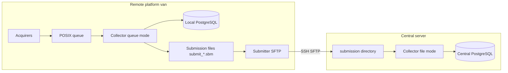

# Network configuration

VanDAQ often runs as a **remote** DAQ host (van) that records locally and **submits** measurement bundles to a **central** aggregation server. This page describes how those hosts connect and which directories must align.

See [Overview](../overview.md) for roles of acquirer, collector, and submitter. YAML details: [Data chain configuration](../reference/data_chain_configuration.md#submitter-configuration).

## Architecture




- **Remote:** Live instruments → queue → collector → local DB **and** rolling `.sbm` submission files.
- **Central:** No acquirers; collector ingests files dropped by remote submitters into the central DB.

A `**.sbm` file** is a time-bounded batch of measurement dicts written by the remote collector (not raw instrument logs). The central collector unpickles and inserts them into PostgreSQL.

## Multiple remote platforms

Several vans can report to one central server. Each remote host should use a distinct `submissions.submit_file_basename` (e.g. `submit_van1_`, `submit_van2_`) so filenames do not collide. All remotes may use the same `REMOTE_PATH` and central `submit_file_dir` if that directory is shared; the basename prefix identifies the platform.

## Remote platform

### Processes that use the network


| Process   | Network use                                               |
| --------- | --------------------------------------------------------- |
| Acquirer  | Usually local serial/USB/Ethernet only                    |
| Collector | Local DB; writes submission files to disk                 |
| Submitter | Ping + SSH/SFTP to central server                         |
| Dashboard | Local DB; optional LAN access for browsers and tileserver |


Enable the submitter in `vandaq_admin.yaml` (`launch_submitter: true`) and configure `submitter/vandaq_submitter.yaml`.

### Submitter configuration


| Key                   | Purpose                                                                                                               |
| --------------------- | --------------------------------------------------------------------------------------------------------------------- |
| `STATIONARY_HOST`     | Central server hostname or IP                                                                                         |
| `SSH_PORT`            | SSH port (commonly `22`)                                                                                              |
| `USERNAME`            | SSH account on central host                                                                                           |
| `PRIVATE_KEY_PATH`    | RSA private key for key-based login                                                                                   |
| `PING_HOST`           | Host for `ping` connectivity check (often same as central)                                                            |
| `CHECK_INTERVAL`      | Seconds between transfer attempts                                                                                     |
| `DATA_DIR`            | Where remote collector writes pending `submit_*.sbm` files                                                            |
| `ARCHIVE_DIR`         | Local directory after successful upload                                                                               |
| `REMOTE_PATH`         | Directory on central server where files are placed (should end with `/`; paths are built as `REMOTE_PATH` + filename) |
| `SUBMIT_FILE_PATTERN` | Glob under `DATA_DIR` (e.g. `submit_*.sbm`)                                                                           |


Example:

```yaml
STATIONARY_HOST: "central.example.org"
SSH_PORT: 22
USERNAME: "vandaq"
PRIVATE_KEY_PATH: "/home/vandaq/.ssh/id_central"
PING_HOST: "central.example.org"
CHECK_INTERVAL: 10
DATA_DIR: "/home/vandaq/vandaq/collector/submission/"
ARCHIVE_DIR: "/home/vandaq/vandaq/collector/submission/submitted"
REMOTE_PATH: "/home/vandaq/vandaq/collector/submission/"
SUBMIT_FILE_PATTERN: "submit_*.sbm"
```

### Remote collector (queue mode)

Use `collector/vandaq_collector.yaml` with a `queue` block plus `submissions`:

- `submissions.submit_file_dir` must match submitter `DATA_DIR` (same path where `.sbm` files appear).
- `submit_file_basename` / `submit_file_minutes` control how often new files are rolled.

## Central platform

On the aggregation server, set `launch_submitter: false` in `vandaq_admin.yaml`. Only the file-mode collector (and dashboards/filers as needed) should run there.

### Collector (submission-file mode)

Use `collector/vandaq_collector_submission.yaml` **without** a `queue` block. The collector scans for incoming files:


| Key                               | Purpose                                                             |
| --------------------------------- | ------------------------------------------------------------------- |
| `submissions.submit_file_dir`     | Directory where SFTP uploads land (must match remote `REMOTE_PATH`) |
| `submissions.submitted_file_dir`  | Archive after successful ingest                                     |
| `submissions.submit_file_pattern` | Glob for pending files                                              |
| `connect_string`                  | Central PostgreSQL URL                                              |


**Permissions:** The SSH account (`USERNAME`) must be able to create files in `REMOTE_PATH` / `submit_file_dir`. The user running the central collector must be able to read pending files and move them into `submitted_file_dir`.

**Failed ingest:** If the central collector cannot process a file, it may move it under `submitted_file_dir/rejected/`. Check that folder when data is missing from the central database but files arrived on disk.

## Path alignment checklist

These paths must agree across hosts:


| Location             | Remote collector              | Remote submitter      | Central collector                        |
| -------------------- | ----------------------------- | --------------------- | ---------------------------------------- |
| Pending files        | `submissions.submit_file_dir` | `DATA_DIR`            | —                                        |
| After remote upload  | —                             | `ARCHIVE_DIR` (local) | `submissions.submit_file_dir` (incoming) |
| Central intake       | —                             | `REMOTE_PATH`         | `submissions.submit_file_dir`            |
| After central ingest | —                             | —                     | `submissions.submitted_file_dir`         |


Filename pattern: remote collector prefix (`submit_file_basename`) + roll time + `.sbm`; submitter glob `submit_*.sbm`.

## Firewall and ports


| Traffic            | Direction          | Port / protocol                | Notes                                                                      |
| ------------------ | ------------------ | ------------------------------ | -------------------------------------------------------------------------- |
| Central submission | Van → central      | TCP `SSH_PORT` (often 22)      | SFTP runs over SSH; no separate FTP port                                   |
| Connectivity check | Van → `PING_HOST`  | ICMP (if allowed)              | Some networks block ping; SSH may still work                               |
| PostgreSQL         | Local on each host | TCP 5432 (localhost)           | Not exposed for van→central sync                                           |
| Dash / tileserver  | LAN → van          | App-specific (e.g. 8080 tiles) | Separate from central aggregation; see [map tiles](../guides/map_tiles.md) |


Inbound connections to the van are not required for submission. Outbound SSH from the van to the central host must be permitted.

## Offline and deferred upload

When the network or central host is unavailable, the submitter logs errors and sleeps for `CHECK_INTERVAL` seconds before retrying. Measurement capture continues: acquirers and the remote collector still update the **local** database and write new `.sbm` files into `DATA_DIR`.

Pending files accumulate until upload succeeds, then move to `ARCHIVE_DIR`. Monitor free disk space on long outages. Do not delete pending `.sbm` files unless you intend to skip that interval of central data.

## SSH setup

1. On the remote host, generate a key pair if needed: `ssh-keygen -t rsa -b 4096 -f ~/.ssh/id_central`
2. Install the **public** key in `~/.ssh/authorized_keys` on the central server for `USERNAME`.
3. Set `PRIVATE_KEY_PATH` to the private key on the remote host.
4. Test manually:

```bash
ssh -i ~/.ssh/id_central -p 22 vandaq@central.example.org
```

`STATIONARY_HOST` may be a DNS name or IP; the van must resolve it on the networks it uses (cellular DNS can differ from lab Wi‑Fi).

The submitter uses Paramiko with `AutoAddPolicy` for host keys. For production, pin the central host key in `known_hosts` or disable trusting unknown keys, especially if the central server has a stable address.

## Connectivity checks

The submitter loop:

1. Pings `PING_HOST` (ICMP).
2. Attempts SSH to `STATIONARY_HOST`:`SSH_PORT` with the configured key.
3. SFTP-uploads each matching file in `DATA_DIR`, then moves it to `ARCHIVE_DIR`.

Watch `submitter/log/submitter.log` for “Network is unavailable” or SSH errors.

## Dashboard and tileserver on the van

Browsers on the LAN may open the Dash app or map tiles on the van’s IP. That traffic is separate from central submission. See [Offline map tiles](../guides/map_tiles.md) for `mapping.tile_server.base_url`.

## Related

- [Installation](installation.md)
- [Operation and troubleshooting](operation_and_troubleshooting.md)

