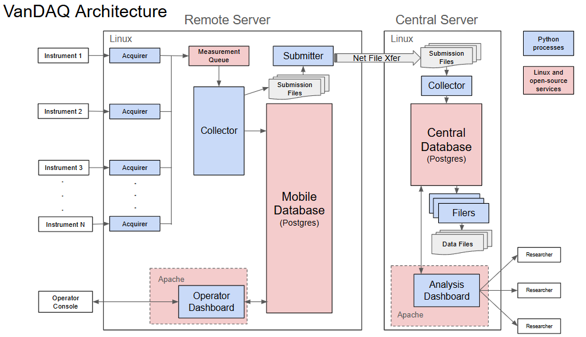

# Overview

VanDAQ is an open-source scientific
data‑acquisition system for mobile platforms carrying multiple
measurement instruments. It supports a wide range of instrument
makes, communication protocols, and data formats, delivering unified,
time‑synchronized, geolocated recording and reporting. VanDAQ
can aggregate measurements from multiple platforms to a central
server, produce consolidated data files, and provide a web
application for near‑real‑time diagnostics—instrument
and engineering readouts, alarm handling and visualization, remote
instrument control, and maps of real‑time and historical
data.

This manual provides comprehensive instructions for
understanding, installing, configuring, and operating VanDAQ.  A
working knowledge of Linux command line interface, directory
structure, configuration files, process management, and service
administration is required.

## Architecture and Theory of Operation

The data delivery methods and formats of
scientific instruments are heterogeneous, varying by type, make, and
model of instrument.  In any particular study using instrumental
measurements, it is generally desired to have data from these
heterodox instruments reported as a merged, unified dataset.  In
addition, it is a typical requirement on any particular measurement
campaign or long-term measurement project to be able to add or remove
instruments from the measurement suite as new capabilities are
required, or old measurements are deemed unneeded.  The VanDAQ
architecture is designed to fulfill these requirements.

For economy of development and ease of adoption,
VanDAQ is designed to leverage free, open-source software components
throughout.  The major software tools incorporated are:

* Operating System: Linux
* Process programming language: Python
* Configuration file format: YAML
* Relational database management system: PostgreSQL
* Web service: Apache2
* Web application framework: Plotly Dash
* Network file transfer: SFTP

The architecture can be visualized like so:

Each measurement platform, including mobile platforms such as vans,
cars, or aircraft, or stationary platforms such as weather stations
or measurement towers, has its own Linux server, referred to as a
mobile or remote server, which unifies and records data from that
platform’s instrument suite.  Multiple remote servers can report
their collected data to a single central server that further
aggregates the platform data into a single database.

The operation of VanDAQ is best understood from the perspective of
its core Python processes: the aquirer, collector, submitter, the
dashboards, and the filers. These, along with the Postgres RDBMS,
make up the **VanDAQ data chain** .  Understanding these components
is central to using and maintaining VanDAQ installations.

### Acquirer

Each instrument has an acquirer process running on
its platform’s remote server.  The acquirer collects and parses
data delivered from the instrument through its particular connection
protocol (serial, Ethernet, etc.) and its instrument-specific data
format.  As it collects instrument readings, the acquirer matches
incoming values against a configured set of alarm rules and generates
alarm messages for any out of bounds values.  If the data is coming
in faster than the dataset master time resolution (typically 1 sec),
the acquirer can aggregate values to match the desired time scale.
Once collected and optionally aggregated, the acquirer converts the
values into a common-currency data format, a Python dict for each
value containing metadata to describe the data value.  Dict keys are:

`platform`:
a name string for the measurement platform (e.g. van1, sams_car,
mt_diablo_tower)

`instrument`:
a unique name for the instrument (e.g. licor_7400_1, methane_a)

`parameter`:
the name of the measurement parameter (e.g. CO, CO2, solar_rad, CH4)

`unit`:
the measurement unit (e.g. ppm, ppb, W/m2)

`acquisition_type`:
a custom parameter type (e.g. environmental, engineering, GPS)

`sample_time`:
the time of sample collection, adjusted from the server time by a
configured lag time

`acquisition_time`:
the server time at moment of collection

`instrument_time`:
the instrument clock time, if reported

`value`:
the numeric measurement value

`string`:
the measurement string, if the value is reported such (most often for
engineering status values)

‘alarms:
a list of dicts describing any alarms generated by this readings

All
instrument acquirer process are spawned from a single Python code
base.  The individual acquirer process  is configured via a YAML
formatted configuration text file describing the instrument
collection type and protocol, data format, metadata such as platform
name, instrument name, etc., and alarm criteria.

Any
instrument may package many values into each of its measurement data
packets.  The acquirer in tern delivers a separate measurement dict
for each value.  The acquirer delivers its data dicts into the VanDAQ
data stream by pushing the dicts into a Posix inter-process
communication queue, a service of the Linux OS. All acquirers in a
platform put their data into the same queue.

### Collector

The collector process collects measurement dicts
produced by the various acquirers and inserts measurement values and
their metadata into the platform’s PostgreSQL database.  The
collector is the only VanDAQ process that writes to the relational
database.  The source of the measurement dicts depends on whether the
collector is running on a remote or the central platform.

On a remote platform, acquirers feed their
measurement dicts into a message queue, as previously described.  The
collector on a remote platform gets these measurement dicts from the
queue and inserts the measurement data into the remote database.  In
addition, the remote platform collector repackages the measurement
dicts in batches into submission files that are stored in the Linux
file system on the remote server.  These submission files are later
transferred over a network connection to the central platform server
by the submitter process.

On the central platform there are typically no
measurement instruments or acquirers, and thus no measurement queue.
The collector on the central platform monitors a receiving file
directory into which submission files have been transferred by the
remote platform submitter(s).  The collector opens and reads the
measurement dicts from the submission files, inserts their
measurement data into the central platform’s database, and moves
the files to an archive directory once ingested.

### Submitter

The submitter process runs on the remote
platform(s) and continuously monitors for new submission files
created by the remote platform’s collector. The submitter is
configured with the IP address of the central platform server and
repeatedly checks for network connectivity between the remote and
central platform.  If submission files are available and connectivity
is established, the submitter transfers the remote submission files
to the central server via SSH and moves the local copies of the files
to an archive directory on the remote platform.

### Dashboards

The VanDAQ dashboard web application queries data
from the PostgreSQL RDBMS, and presents pages with a number of
functions for the users:

* A
  real-time diagnostic display for incoming data from the suite of
  instruments on a remote platform, displaying time series plots and
  latest values of the most recent data coming in.  This is a primary
  tool for verifying operation of and communication with instruments,
  and verifying the functioning of the VanDAQ data chain.
* An
  alarm table detailing the latest out-of-bounds readings for all
  instruments.
* A
  real-time map displaying geolocated tracks of instrument
  measurements as data develops
* Configurable
  controls that send commands to instruments

### Filers

Filers are scripts that query the PostgreSQL RDBMS and format and write text
data files to serve as feedstock for post-processing and analysis.
