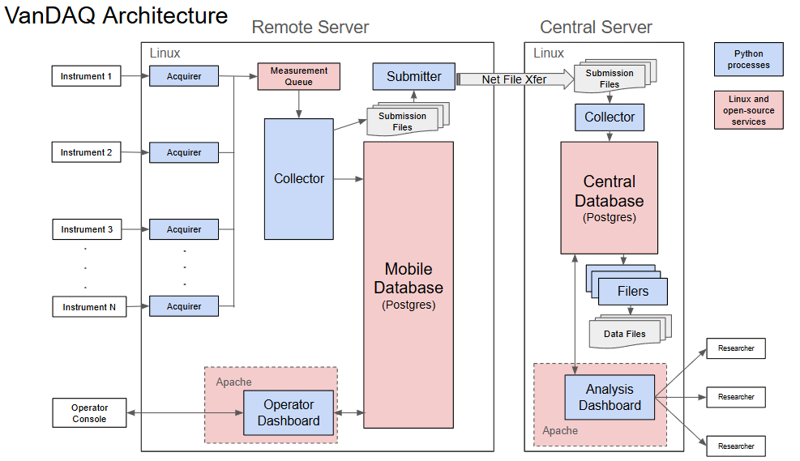

# Overview

VanDAQ is an open-source scientific data-acquisition system for mobile platforms carrying multiple measurement instruments. It supports a wide range of instrument makes, communication protocols, and data formats, delivering unified, time-synchronized, geolocated recording and reporting. VanDAQ can aggregate measurements from multiple platforms to a central server, produce consolidated data files, and provide a web application for near-real-time diagnostics—instrument and engineering readouts, alarm handling and visualization, remote instrument control, and maps of real-time and historical data.

This manual provides comprehensive instructions for understanding, installing, configuring, and operating VanDAQ. A working knowledge of the Linux command line, directory structure, configuration files, process management, and service administration is required.

## Architecture and Theory of Operation

The data delivery methods and formats of scientific instruments are heterogeneous, varying by type, make, and model. In any particular study, it is generally desired to have data from these instruments reported as a merged, unified dataset. It is also typical to add or remove instruments from the measurement suite as capabilities change. The VanDAQ architecture is designed to fulfill these requirements.

For economy of development and ease of adoption, VanDAQ leverages free, open-source software components throughout:

- **Operating system:** Linux
- **Process language:** Python
- **Configuration:** YAML
- **Database:** PostgreSQL
- **Web service:** Apache2
- **Web application:** Plotly Dash
- **File transfer:** SFTP

The architecture can be visualized as follows:

Each measurement platform—mobile (vans, cars, aircraft) or stationary (weather stations, towers)—has its own Linux server, referred to as a **remote server**, which unifies and records data from that platform’s instrument suite. Multiple remote servers can report to a single **central server** that aggregates platform data into one database.

VanDAQ is best understood through its core Python processes—the **acquirer**, **collector**, **submitter**, **dashboards**, and **filers**—together with PostgreSQL. These make up the **VanDAQ data chain**.

### Acquirer

Each instrument has an acquirer process on its platform’s remote server. The acquirer collects and parses data from the instrument over its connection protocol (serial, Ethernet, etc.) and instrument-specific format. As readings arrive, the acquirer applies configured alarm rules. If data arrives faster than the dataset master time resolution (typically 1 second), the acquirer can aggregate values to the desired time scale.

Collected values are converted into a common format: a Python dict per measurement with metadata keys:

| Key | Description |
|-----|-------------|
| `platform` | Measurement platform name (e.g. `van1`, `sams_car`, `mt_diablo_tower`) |
| `instrument` | Unique instrument name (e.g. `licor_7400_1`, `methane_a`) |
| `parameter` | Measurement parameter (e.g. `CO`, `CO2`, `solar_rad`, `CH4`) |
| `unit` | Unit (e.g. `ppm`, `ppb`, `W/m2`) |
| `acquisition_type` | Parameter category (e.g. environmental, engineering, GPS) |
| `sample_time` | Sample time, adjusted from server time by a configured lag |
| `acquisition_time` | Server time at collection |
| `instrument_time` | Instrument clock time, if reported |
| `value` | Numeric measurement value |
| `string` | String value when the instrument reports text (often engineering status) |
| `alarms` | List of dicts describing alarms generated for this reading |

All instrument acquirer processes share one Python codebase. Each process is configured via a YAML file describing collection type, protocol, data format, platform and instrument names, and alarm criteria.

An instrument may send many values in one packet; the acquirer emits a separate measurement dict per value. Dicts are pushed into a POSIX message queue (Linux IPC). All acquirers on a platform use the same queue.

### Collector

The collector ingests measurement dicts from acquirers and inserts values and metadata into the platform’s PostgreSQL database. It is the only VanDAQ process that writes to the database. The data source depends on whether the collector runs on a remote or central platform.

**Remote platform:** Acquirers write to a message queue. The remote collector reads the queue, inserts into the remote database, and batches dicts into submission files on the local filesystem for later transfer by the submitter.

**Central platform:** There are typically no acquirers or measurement queue. The central collector watches a directory where remote submitters deposit submission files, ingests the measurement dicts into the central database, and archives processed files.

### Submitter

The submitter runs on remote platform(s) and watches for submission files from the remote collector. It is configured with the central server address and checks network connectivity. When files are available and the network is up, it transfers submission files to the central server over SSH and archives local copies on the remote platform.

### Dashboards

The VanDAQ dashboard web application queries PostgreSQL and provides:

- **Live diagnostics** — time series and latest values for the instrument suite; primary tool for verifying instruments, communication, and the data chain
- **Alarms** — table of recent out-of-bounds readings
- **Map** — geolocated tracks as data develops
- **Controls** — configurable commands to instruments

### Filers

Filers are scripts that query PostgreSQL and write formatted text files for post-processing and analysis.
