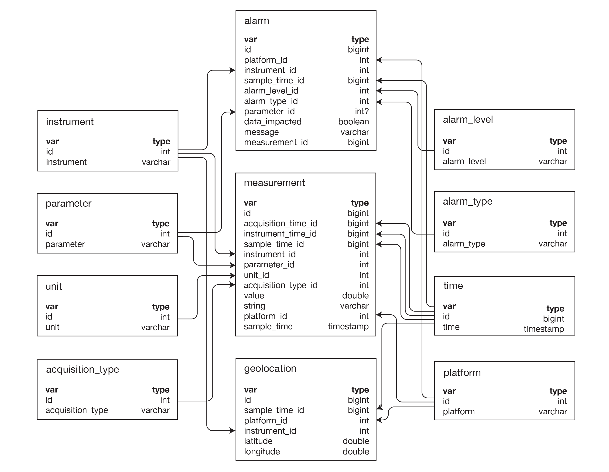

# Database schema

VanDAQ stores time-series measurements in **PostgreSQL**. The canonical SQL definition is [`schema/vandaq_schema_dump.sql`](../../schema/vandaq_schema_dump.sql). SQLAlchemy models live in [`common/vandaq_schema.py`](../../common/vandaq_schema.py).

Load the schema during [Installation](../operations/installation.md#2-postgresql-database).

## Schema diagram



The diagram omits `instrument_measurements` (metadata cache of parameter combinations per instrument); see **Core tables** below.

## Design pattern

- **Dimension tables** hold stable lookup values (`platform`, `instrument`, `parameter`, `unit`, `acquisition_type`, alarm levels/types).
- **`measurement`** is the main fact table (numeric `value` or string readings).
- **`time`** stores timestamps; fact rows reference `sample_time_id`, `acquisition_time_id`, and optional `instrument_time_id`.
- **`instrument_measurements`** records which parameter/unit/acquisition-type combinations each instrument has produced (metadata cache).
- **`geolocation`** stores lat/lon keyed by platform, instrument, and sample time.
- **`alarm`** links alarms to measurements and dimension rows.

The collector creates dimension rows automatically the first time it sees new names in measurement dicts ([Adding a new instrument](../adding_a_new_instrument.md)).

## Core tables

| Table | Role |
|-------|------|
| `platform` | Measurement platform name (e.g. `van1`) |
| `instrument` | Instrument name (matches acquirer YAML `instrument`) |
| `parameter` | Parameter name (e.g. `CO2`, `latitude`) |
| `unit` | Unit string (e.g. `ppm`, `deg`) |
| `acquisition_type` | Category (environmental, engineering, GPS, …) |
| `time` | Normalized timestamp values |
| `measurement` | Fact rows: values, foreign keys to dimensions and time |
| `instrument_measurements` | Metadata cache: one row per unique (instrument, parameter, unit, acquisition_type); optional `platform_id` |
| `geolocation` | GPS track points (`latitude`, `longitude`) |
| `alarm` | Alarm events with level, type, message, optional `measurement_id` |
| `alarm_level`, `alarm_type` | Alarm classification dimensions |

## `measurement` columns (main fact)

| Column | Source in measurement dict |
|--------|----------------------------|
| `platform_id` | `platform` |
| `instrument_id` | `instrument` |
| `parameter_id` | `parameter` |
| `unit_id` | `unit` |
| `acquisition_type_id` | `acquisition_type` |
| `value` | `value` (float) |
| `string` | `string` (optional text) |
| `sample_time` / `sample_time_id` | `sample_time` |
| `acquisition_time_id` | `acquisition_time` |
| `instrument_time_id` | `instrument_time` (optional) |

## Views and maintenance

| Object | Purpose |
|--------|---------|
| `alarms_view` | Joined alarm readout for dashboards (platform, instrument, parameter, level, type, message, value) |
| `delete_old_records_log` | Audit log for retention/cleanup jobs (if enabled on your database) |

The dump may include extensions such as `pg_cron`; install matching PostgreSQL packages or trim unused extension blocks for minimal installs.

## Submission files (not in PostgreSQL)

Remote→central transfer uses **`.sbm` files** on disk (pickled measurement batches), not database replication. Paths and alignment are in [Network configuration](../operations/network_configuration.md). The central collector ingests those files into the same table structure above.

## Example queries

Recent measurements for one instrument:

```sql
SELECT t.time AS sample_time, p.parameter, m.value, m.string
FROM measurement m
JOIN instrument i ON m.instrument_id = i.id
JOIN parameter p ON m.parameter_id = p.id
JOIN time t ON m.sample_time_id = t.id
WHERE i.instrument = 'ExampleSensor'
ORDER BY t.time DESC
LIMIT 20;
```

List instruments that have reported:

```sql
SELECT instrument FROM instrument ORDER BY instrument;
```

## Related

- [Data chain configuration](../data_chain_configuration.md)
- [Adding a new instrument](../adding_a_new_instrument.md#database-check)
- [Installation](../operations/installation.md)
